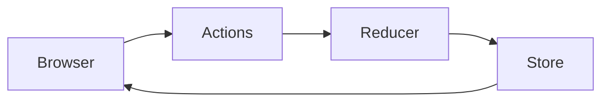

# Blazor State Management

В этом репозитории серия видео роликов на тему "Управление состоянием в Blazor". А также немного поговорим о том, что же такое есть "состояние" в концепции разработки программного обеспечения и, в частности, в языке C#.

Я знаю четыре способа управлять состоянием, и хочу их все показать.

## Вступительно видео

На видео немного подробностей про понятие "состояние". Для тех, кто только начинает программировать это видео будет полезным. Потому что дает представление о том, что будет на последующих видео в этой серии.

[Управление состоянием в Blazor 1](https://www.calabonga.net/blog/post/blazor-state-management-1)

## Первый способ "CascadingValue"

Первый способ самый простой, на мой взгляд, поэтому я начал с него. В основе лежит принцип работы Blazor (внутренние механизмы). Кода писать много не надо, и несмотря на простоту - это очень эффективный способ управления состоянием объекта.

[Управление состоянием в Blazor 2](https://www.calabonga.net/blog/post/blazor-state-management-2)

## Второй способ "StateMachine"

Второй способ уже не использует CascadingValue, а базируется на принципах "подписки" на события. В основе лежит принцип работы с event. Кода придется написать немного побольше, но дает некоторые полезные возможности для расширения функционала.

[Управление состоянием в Blazor 5](https://www.calabonga.net/blog/post/blazor-state-management-3)

## Третий способ "MVVM"

Третий способ базируется также на принципах "подписки" на события, но имеет более универсальный подход и использует паттерн MVVM. Работать также предстоит с event, а раз это MVVM, где бОльшую управляемость мы получаем за счет количества кода обслуживающего конкретный функционал, то снова придется написать еще немного больше кода.

[Управление состоянием в Blazor 4](https://www.calabonga.net/blog/post/blazor-state-management-4)

## Четвертый способ "Redux Pattern"

Четвертый способ основан на Redux Pattern. Те, кто из вас знаком с Single Page Application разработкой на React наверняка слышали про Redux. Как вы понимание, кода снова придется написать еще немного больше чем в прошлые разы. Но поверьте, оно этого стоит.

Также хочу заметить, что на видео я использую Fluxor, эта библиотека - всего ли одна из тех, которые реализуют Redux Pattern. Более того, вы может реализовать Redux Pattern вообще без использования каких либо библиотек, но кода придется написать во много раз больше. :)

[Управление состоянием в Blazor 5](https://www.calabonga.net/blog/post/blazor-state-management-5)

## Комментарии, пожелания, замечания

Пишите комментарии к видео на сайте [www.calabonga.net](https://www.calabonga.net)

# Автор

Сергей Калабонга (Calabonga)

[Блог по программированию](https://www.calabonga.net)
